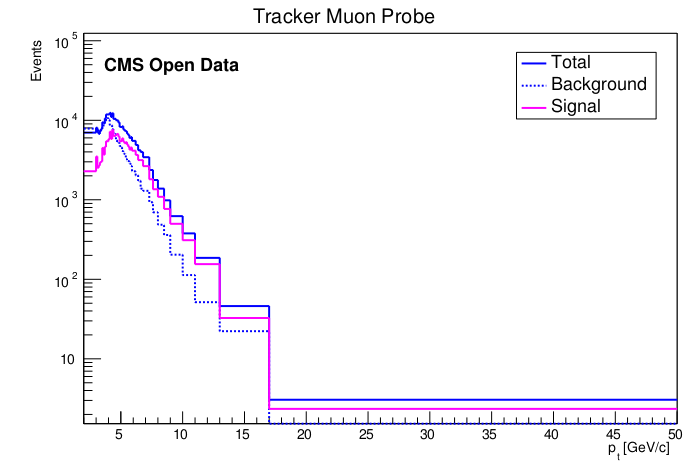
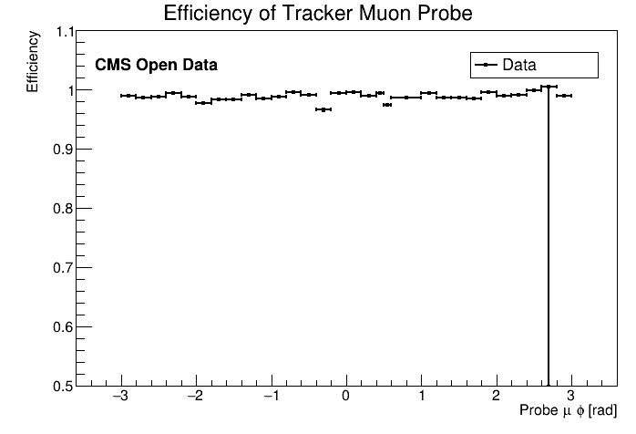

### Signal extraction: sideband subtraction method

The efficiency is calculated using **only signal muons**. So it needs a way to extract signal from the dataset. Another method to do this is usng the sideband subtraction method.

This method consists in choosing sideband and signal regions in invariant mass histogram. The sideband regions is supposed to have only background particles and the signal region have background and signal particle.

> Note: we choosed only the Upsilon (1S) signal as signal region because the simulations dataset does only have Upsilon (1S) signal.

With this in mind, we plot a quantity histogram for signal region and sideband region. Then the signal histogram is subtracted usign this formula:

Where:

And for uncertain:

Applying those equations we get histograms like this:

* Solid blue line (Total) = particles in signal region;
* Dashed blue line (Background) = particles in sideband regions;
* Solid magenta line (signal) = signal histogram subtracted.

You will see this histogram on this exercise.

> ## About this code
>
> More info about this code can be [found here](http://tagandprobe-documentation.web.cern.ch/tagandprobe-documentation/).
> 
{: .callout}

## Preparing files

Firstly, we need to get the code. Type on your terminal;

~~~
git clone -b sideband https://github.com/allanjales/efficiency_tagandprobe
cd efficiency_tagandprobe
~~~
{: .language-bash}

Now we want to copy Upsilon dataset (from run 2011) file to machine running this command (It is about 441 MB):

~~~
wget --load-cookies /tmp/cookies.txt "https://docs.google.com/uc?export=download&confirm=$(wget --quiet --save-cookies /tmp/cookies.txt --keep-session-cookies --no-check-certificate 'https://docs.google.com/uc?export=download&id=1Fj-rrKts8jSSMdwvOnvux68ydZcKB521' -O- | sed -rn 's/.*confirm=([0-9A-Za-z_]+).*/\1\n/p')&id=1Fj-rrKts8jSSMdwvOnvux68ydZcKB521" -O Run2011A_MuOnia_Upsilon.root && rm -rf /tmp/cookies.txt
~~~
{: .language-bash}

This code seems to be large, but it is required to copy large files from google drive.

Run this code to download the simulated data ntupple for Upsilon (It is about 66 MB):

~~~
wget --load-cookies /tmp/cookies.txt "https://docs.google.com/uc?export=download&confirm=$(wget --quiet --save-cookies /tmp/cookies.txt --keep-session-cookies --no-check-certificate 'https://docs.google.com/uc?export=download&id=1ZzAOOLCKmCz0Q6pVi3AAiYFGKEpP2efM' -O- | sed -rn 's/.*confirm=([0-9A-Za-z_]+).*/\1\n/p')&id=1ZzAOOLCKmCz0Q6pVi3AAiYFGKEpP2efM" -O Upsilon1SToMuMu_MC_full.root && rm -rf /tmp/cookies.txt
~~~
{: .language-bash}

Now, verify if everything is ok:

~~~
ls
~~~
{: .language-bash}

~~~
main  README.md  Run2011A_MuOnia_Upsilon.root  Upsilon1SToMuMu_MC_full.root
~~~
{: .output}

Now your `efficiency_tagandprobe` folder will have these files:

## Preparing code for Run 2011

> It will teach you localize files by terminal, but you can use some file explorer program.

Now we need to edit some settings. Go localize **settings.cpp**:

~~~
cd main/config
ls
~~~
{: .language-bash}

~~~
cuts.h  settings.cpp
~~~
{: .output}

There is some ways to open this file. You can try run:

~~~
gedit settings.cpp
~~~
{: .language-bash}

Else if it does no work, try use nano:

~~~
nano settings.cpp
~~~
{: .language-bash}

We are looking for calculating **efficiencies of tracker muons**, so do not need to measure standalone and global.

With **settings.cpp** file opened, make sure let variables like this:

~~~
//Canvas drawing
bool shouldDrawInvariantMassCanvas       = true;
bool shouldDrawInvariantMassCanvasRegion = true;
bool shouldDrawQuantitiesCanvas          = true;
bool shouldDrawEfficiencyCanvas          = true;

//Muon id analyse	
bool doTracker    = true;
bool doStandalone = false;
bool doGlobal     = false;
~~~
{: .language-cpp}

Also we are looking for getting efficiency of specifics file we downloaded. They name are `Run2011A_MuOnia_Upsilon.root` and `Upsilon1SToMuMu_MC_full.root`. They are listed in `const char *files[]`. While **settings.cpp** is open, try to use the variable `int useFile` to run `Run2011A_MuOnia_Upsilon.root`.

> ## How to do this
>
> Make sure `useFile` is correct:
>
> ~~~
> //List of files
> const char *files[] = {"../data_histoall.root",
>                        "../Run2011AMuOnia_mergeNtuple.root",""
>                        "../JPsiToMuMu_mergeMCNtuple.root",
>                        "../Run2011A_MuOnia_Upsilon.root",
>                        "../Upsilon1SToMuMu_MC_full.root"};
> 
> const char* directoriesToSave[] = {"../results/result/",
>                                    "../results/Jpsi Run 2011/",
>                                    "../results/Jpsi MC 2020/",
>                                    "../results/Upsilon Run 2011/",
>                                    "../results/Upsilon MC 2020/"};
> 
> 
> //MAIN OPTIONS
> 
> //Which file of files (variable above) should use
> int useFile = 3;
> ~~~
> {: .language-cpp}
>
> It will tell which configuration will use. So, the macro will run with the Ntupple in `files[useFile]` and results will be stored in `directoriesToSave[useFile]`.
>
> Three firsts files are not used in this execise.
{: .solution}

> ## About code
>
> Normally we need to set variabl
e `bool isMC` and `const char* resonance`, but at this time it is done already and set automatically for these ntupples names.
>
> Also this code was made for Upsilon and J/psi only. We pretend to work on for Z Boson in future.
{: .callout}

## Editting bins

To change binnig, find **PassingFailing.h**

~~~
cd ../classes
ls
~~~
{: .language-bash}

~~~
FitFunctions.h   MassValues.h      PtEtaPhi.h             TagProbe.h
InvariantMass.h  PassingFailing.h  SidebandSubtraction.h  Type.h
~~~
{: .output}

Open **PassingFailing.h**

~~~
gedit PassingFailing.h
~~~
{: .language-bash}

Search for `createEfficiencyPlot(...)` function. You will find something like this:

~~~
void createHistogram(TH1D* &histo, const char* histoName)
{...}
~~~
{: .language-cpp}

For each quantity (pT, eta, phi) is there different bins. A way to change them is look inside `createEfficiencyPlot(...)` function. In a simplifyied version, you are going to see a structure like this:

~~~
//Variable bin for pT
if (strcmp(quantityName, "Pt") == 0)
{
	//Here creates histogram for pT
}

//Variable bin for eta
else if (strcmp(quantityName, "Eta") == 0)
{
	//Here creates histogram for eta
}

//Bins for phi
else
{
	//Here creates histogram for phi
}
~~~
{: .language-cpp}

> ## See whole scructure
> 
> Do not be scred! Codes do not bite.
>
> ~~~
> //Variable bin for pT
> if (strcmp(quantityName, "Pt") == 0)
> {
> 	double xbins[10000];
> 	xbins[0] = .0;
> 	int nbins = 0;
> 	double binWidth = 1.;
> 	for (int i = 1; xbins[i-1] < xMax+binWidth; i++)
> 	{
> 		xbins[i] = xbins[i-1] < 1. ? 1. : xbins[i-1] *(1+binWidth);
> 		nbins++;
> 	}
> 
> 	histo = new TH1D(hName.data(), hTitle.data(), nbins, xbins);
> }
> 
> //Variable bin for eta
> else if (strcmp(quantityName, "Eta") == 0)
> {
> 	double xbins[10000];
> 	xbins[0] = .5;
> 	int nbins = 0;
> 	double binWidth = 0.2;
> 
> 	//For positive
> 	for (int i = 1; xbins[i-1] < xMax+binWidth; i++)
> 	{
> 		xbins[i] = xbins[i-1] < 1. ? 1. : xbins[i-1] *(1+binWidth);
> 		nbins++;
> 	}
> 
> 	//Duplicate array and create another
> 	double rxbins[nbins*2+1];
> 	int entry = 0;
> 	for (int i = nbins; i >= 0; i--)
> 	{
> 		rxbins[entry] = -xbins[i];
> 		entry++;
> 	}
> 	rxbins[entry] = 0.;
> 	entry++;
> 	for (int i = 0; i <= nbins; i++)
> 	{
> 		rxbins[entry] = xbins[i];
> 		entry++;
> 	}
> 	
> 	histo = new TH1D(hName.data(), hTitle.data(), entry-1, rxbins);
> }
> 
> //Bins for phi 
> else
> {
> 	if (strcmp(quantityUnit, "") == 0)
> 	{
> 		yAxisTitleForm += " / (%1." + to_string(decimals) + "f)";
> 	}
> 	else
> 	{
> 		yAxisTitleForm += " / (%1." + to_string(decimals) + "f " + string(quantityUnit) + ")";
> 	}
> 
>  histo = new TH1D(hName.data(), hTitle.data(), nBins, xMin, xMax);
> } 
> ~~~
> {: .language-cpp}
{: .solution}

In those commented lines inside conditionals there are codes to create histograms bins. You can edit them to create histogram bins however you want. But, instead of doing create a code to create bins for us, we can write by hand a array of bins for histogram creation.

As we are going to compare with fitting method, we should use the same bins. Change your the code to this:

~~~
//Variable bin for pT
if (strcmp(quantityName, "Pt") == 0)
{
	double xbins[] = {2, 3.0, 3.1, 3.2, 3.3, 3.4, 3.5, 3.6, 3.7, 3.8, 4, 4.1, 4.2, 4.3, 4.4, 4.5, 4.6, 4.7, 4.8, 4.9, 5.0, 5.1, 5.2, 5.3, 5.4, 5.5, 5.6, 5.7, 5.8, 5.9, 6.2, 6.4, 6.6, 6.8, 7.3, 7.6, 8.0, 8.5, 9.0, 10.0, 11.0, 13.0, 17.0, 50.0};
	int nbins = 43;

	histo = new TH1D(hName.data(), hTitle.data(), nbins, xbins);
}

//Variable bin for eta
else if (strcmp(quantityName, "Eta") == 0)
{
	double xbins[] = {-2.0, -1.9, -1.8, -1.7, -1.6, -1.5, -1.4, -1.2, -1.0, -0.8, -0.6, -0.4, 0, 0.2, 0.4, 0.6, 0.7, 0.95, 1.2, 1.4, 1.5, 1.6, 2.0};
	int nbins = 22;

	histo = new TH1D(hName.data(), hTitle.data(), nbins, xbins);
}

//Bins for phi
else
{
	double xbins[] =  {-3, -2.8, -2.6, -2.4, -2.2, -2.0, -1.8, -1.6, -1.4, -1.2, -1.0, -0.8, -0.6, -0.4, -0.2, 0, 0.2, 0.4, 0.5, 0.6, 1.0, 1.2, 1.4, 1.6, 1.8, 2.0, 2.2, 2.4, 2.6, 2.8, 3.0};
	int nbins = 30;

	histo = new TH1D(hName.data(), hTitle.data(), nbins, xbins);
}
~~~
{: .language-cpp}

Now we have a different bins creation.

## Running the code

After set configurations, it is time to run the code. Go back to **main** directory and make sure `macro.cpp` is there.

~~~
cd ..
ls
~~~
{: .language-bash}

~~~
classes  compare_efficiency.cpp  config  macro.cpp
~~~
{: .output}

Initialize root:

~~~
root -l
~~~
{: .language-bash}

~~~
root[0]
~~~
{: .output}

Now run the macro.cpp:

~~~
.x macro.cpp
~~~
{: .language-bash}

~~~
"../results/Upsilon Run 2011/" directory created OK
Using "../Run2011A_MuOnia_Upsilon.root" ntupple
resonance: Upsilon
Using method 2
Data analysed = 986100 of 986100
~~~
{: .output}

In this process, more informations will be printed in terminal while plots will pop up on your screen (these plots are been saved in a folder). **It will take a couple of minutes**. The message below represents that code finish running:

~~~
Done. All result files can be found at "../results/Upsilon Run 2011/"

root[1]
~~~
{: .output}

> ## Common errors
>
> If you run the code and your terminal printed some erros like:
>
> ~~~
> Error in <ROOT::Math::Cephes::incbi>: Wrong domain for parameter b (must be > 0)
> ~~~
> {: .error}
>
> It occours when a bin of pass histogram is greater than total histogram. With sideband subtraction, depending on bins you choose, this can happen.
> As we are looking for compare efficiencies between sideband subtraction and fitting method, it is good to use same bins.
> This is also the reason for some enormous error bars.
>
> Just ignore it.
> 
{: .callout}

Now you can type the command below to **quit root** and close all created windows:

~~~
.q
~~~
{: .language-bash}

## Probe Efficiency results for Run 2011

If you did everything right, your results are going to be like these:

## Preparing and running the code for simulated data

> ## Challenge
>
> Try to run the same code for `Upsilon1SToMuMu_MC_full.root` file we downloaded.
>
> > ## Tip
> > 
> > You will need the redo the steps above, but setting:
> > ~~~
> > int useFile = 3;
> > ~~~
> > {: .language-cpp}
> >
> > in `main/config/settings.cpp` file.
> >
> {: .solution}
>
{: .challenge}

