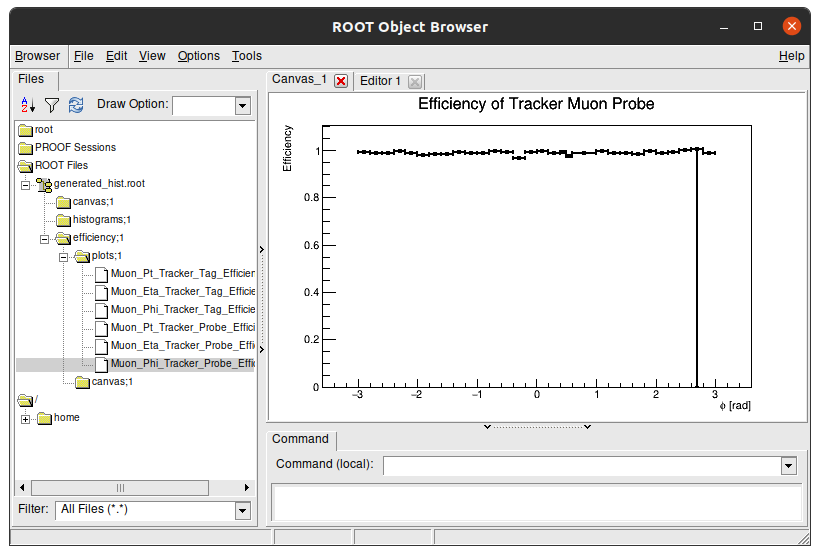
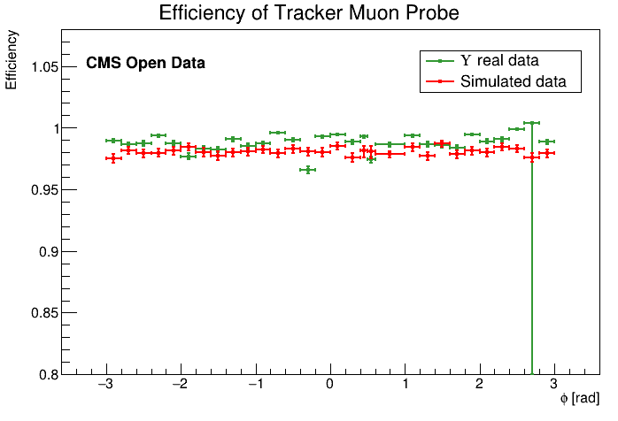
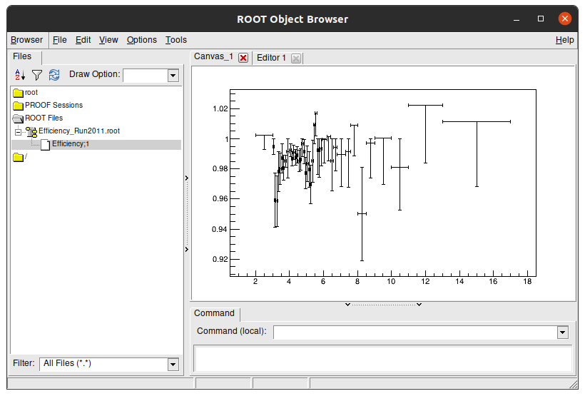
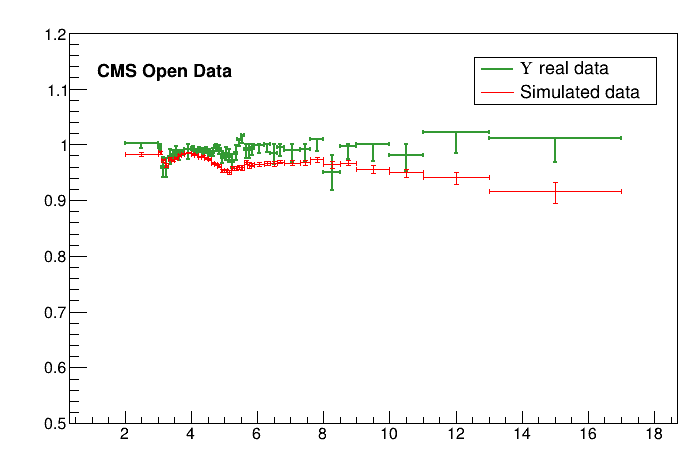
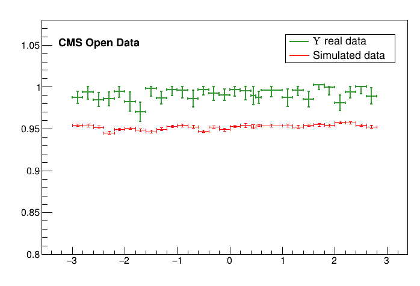

## How sideband subtraction method code stores its files

Sideband subtraction saves every efficiency plot in `efficiency/plots/` folder inside a single `generated_hist.root` file. Lets check it!

You probably now are in `main` directory. Lets go back a directory above.

~~~
cd ..
ls
~~~
{: .language-bash}

~~~
main  README.md  results  Run2011A_MuOnia_Upsilon.root  Upsilon1SToMuMu_MC_full.root
~~~
{: .output}

Now, a folder named `results` appeared on this folder. Lets go check inside.

~~~
cd results
ls
~~~
{: .language-bash}

~~~
'Comparison Upsilon Sideband Run vs MC'  'Upsilon MC 2020'  'Upsilon Run 2011'
~~~
{: .output}

If you did every step of sideband subtraction and this page lesson, this results should match with results on your pc. Go inside one of those folders (except comparison).

~~~
cd Upsilon\ Run\ 2011
ls
~~~
{: .language-bash}

~~~
Efficiency_Tracker_Probe_Eta.png  Tracker_Probe_Phi_All.png
Efficiency_Tracker_Probe_Phi.png  Tracker_Probe_Phi_Passing.png
Efficiency_Tracker_Probe_Pt.png   Tracker_Probe_Pt_All.png
Efficiency_Tracker_Tag_Eta.png    Tracker_Probe_Pt_Passing.png
Efficiency_Tracker_Tag_Phi.png    Tracker_Tag_Eta_All.png
Efficiency_Tracker_Tag_Pt.png     Tracker_Tag_Eta_Passing.png
generated_hist.root               Tracker_Tag_Phi_All.png
InvariantMass_Tracker.png         Tracker_Tag_Phi_Passing.png
InvariantMass_Tracker_region.png  Tracker_Tag_Pt_All.png
Tracker_Probe_Eta_All.png         Tracker_Tag_Pt_Passing.png
Tracker_Probe_Eta_Passing.png
~~~
{: .output}

Here is stored as `.png` all outputed code plots you saw running sideband subtraction method. Aside of them there is the `generated_hist.root` with stores the efficiency a way that we can manipulate after. This is a needed file to run comparison between efficiencies for sideband subtraction method. Lets look inside of this file.

Run to open this file with ROOT:

~~~
root -l generated_hist.root
~~~
{: .language-bash}

~~~
root [0] 
Attaching file generated_hist.root as _file0...
(TFile *) 0x55dca0f04c50
root [1]
~~~
{: .output}

Now lets see it content

~~~
new TBrowser
~~~
{: .language-bash}

Now you see in your screen this:

This is a visual navigator of a `.root` file. Here you can see the struture of `generated_hist.root`. Go double clicking on folders to open it and see your content. The Efficiency plots we see are stored in `efficiency/plots/` like we see here:

You can double click each plot to see it content too:

> ## Tip
>
> To close this window, click on terminal and press <kbd>Ctrl + C</kbd>. This command stops any process in terminal.
> 
{: .callout}

> ## Key Point
> 
> * As you see, the `.root` file has a path itself and efficiencies plots inside them has paths too!
> 
{: .keypoints}

## Comparison results between real data and simulated data for sideband method

After runinng sideband subtraction code, we get `.root` with all efficiencies plots inside it in two different folders:

* `../results/Upsilon Run 2011/generated_hist.root`
* `../results/Upsilon MC 2020/generated_hist.root`

It will be seen on discussing below.

Go back inside `main` folder. Inside of it is a code for efficiency plot comparison. Lets check it out.

~~~
cd main
ls
~~~
{: .language-bash}

~~~
classes  compare_efficiency.cpp  config  macro.cpp
~~~
{: .output}

There is it. Now lets open it.

~~~
gedit compare_efficiency.cpp
~~~
{: .language-bash}

It's easy to prepare it for sideband subtraction comparison. Our main edition point can be found in this part:

~~~
int useScheme = 0;
//Upsilon Sideband Run vs Upsilon Sideband MC
//Upsilon Fitting  Run vs Upsilon Fitting  MC
//Upsilon Sideband Run vs Upsilon Fitting  Run

//Root files and paths for Tefficiency objects inside these files
const char* filePathsEff0[][2] = {
	{"../results/Upsilon Run 2011/generated_hist.root", "efficiency/plots/Muon_Pt_Tracker_Probe_Efficiency"},
	{"../results/Upsilon Run 2011/generated_hist.root", "efficiency/plots/Muon_Eta_Tracker_Probe_Efficiency"},
	{"../results/Upsilon Run 2011/generated_hist.root", "efficiency/plots/Muon_Phi_Tracker_Probe_Efficiency"},
	{"../results/Upsilon Run 2011/generated_hist.root", "efficiency/plots/Muon_Pt_Standalone_Probe_Efficiency"},
	{"../results/Upsilon Run 2011/generated_hist.root", "efficiency/plots/Muon_Eta_Standalone_Probe_Efficiency"},
	{"../results/Upsilon Run 2011/generated_hist.root", "efficiency/plots/Muon_Phi_Standalone_Probe_Efficiency"},
	{"../results/Upsilon Run 2011/generated_hist.root", "efficiency/plots/Muon_Pt_Global_Probe_Efficiency"},
	{"../results/Upsilon Run 2011/generated_hist.root", "efficiency/plots/Muon_Eta_Global_Probe_Efficiency"},
	{"../results/Upsilon Run 2011/generated_hist.root", "efficiency/plots/Muon_Phi_Global_Probe_Efficiency"}
};

//Root files and paths for Tefficiency objects inside these files
const char* filePathsEff1[][2] = {
	{"../results/Upsilon MC 2020/generated_hist.root", "efficiency/plots/Muon_Pt_Tracker_Probe_Efficiency"},
	{"../results/Upsilon MC 2020/generated_hist.root", "efficiency/plots/Muon_Eta_Tracker_Probe_Efficiency"},
	{"../results/Upsilon MC 2020/generated_hist.root", "efficiency/plots/Muon_Phi_Tracker_Probe_Efficiency"},
	{"../results/Upsilon MC 2020/generated_hist.root", "efficiency/plots/Muon_Pt_Standalone_Probe_Efficiency"},
	{"../results/Upsilon MC 2020/generated_hist.root", "efficiency/plots/Muon_Eta_Standalone_Probe_Efficiency"},
	{"../results/Upsilon MC 2020/generated_hist.root", "efficiency/plots/Muon_Phi_Standalone_Probe_Efficiency"},
	{"../results/Upsilon MC 2020/generated_hist.root", "efficiency/plots/Muon_Pt_Global_Probe_Efficiency"},
	{"../results/Upsilon MC 2020/generated_hist.root", "efficiency/plots/Muon_Eta_Global_Probe_Efficiency"},
	{"../results/Upsilon MC 2020/generated_hist.root", "efficiency/plots/Muon_Phi_Global_Probe_Efficiency"}
};

//How comparisons will be saved
const char* resultNames[] = {
	"Muon_Pt_Tracker_Probe_Efficiency.png",
	"Muon_Eta_Tracker_Probe_Efficiency.png",
	"Muon_Phi_Tracker_Probe_Efficiency.png",
	"Muon_Pt_Standalone_Probe_Efficiency.png",
	"Muon_Eta_Standalone_Probe_Efficiency.png",
	"Muon_Phi_Standalone_Probe_Efficiency.png",
	"Muon_Pt_Global_Probe_Efficiency.png",
	"Muon_Eta_Global_Probe_Efficiency.png",
	"Muon_Phi_Global_Probe_Efficiency.png"
};
~~~
{: .language-cpp}

> In the scope above we see:
>
> * `int useScheme` represents which comparison are you doing.
> * `const char* filePathsEff0` is a array with location of the first plots.
> * `const char* filePathsEff1` is a array with location of the second plots.
> * `const char resultNames` is a array with names which comparison will be saved.
> 
> Plots in `const char* filePathsEff0[i]` will be compared with plots in `const char* filePathsEff1[i]`. The result will be saved as `const char* resultNames[i]`.

Everything is uptodate to compare sideband subtractions results between real data and simulations, except it is comparing standalone and global muons. As we are **not looking for standalone and global muons efficiencies and we do not have plotted these efficiences, you should **delete lines with Standalone and Global words**

> ## See result scructure
> 
> If you deleted the right lines, your code now should be like this:
>
> ~~~
> int useScheme = 0;
> //Upsilon Sideband Run vs Upsilon Sideband MC
> //Upsilon Fitting  Run vs Upsilon Fitting  MC
> //Upsilon Sideband Run vs Upsilon Fitting  Run
> 
> //Root files and paths for Tefficiency objects inside these files
> const char* filePathsEff0[][2] = {
> 	{"../results/Upsilon Run 2011/generated_hist.root", "efficiency/plots/Muon_Pt_Tracker_Probe_Efficiency"},
> 	{"../results/Upsilon Run 2011/generated_hist.root", "efficiency/plots/Muon_Eta_Tracker_Probe_Efficiency"},
> 	{"../results/Upsilon Run 2011/generated_hist.root", "efficiency/plots/Muon_Phi_Tracker_Probe_Efficiency"}
> };
> 
> //Root files and paths for Tefficiency objects inside these files
> const char* filePathsEff1[][2] = {
> 	{"../results/Upsilon MC 2020/generated_hist.root", "efficiency/plots/Muon_Pt_Tracker_Probe_Efficiency"},
> 	{"../results/Upsilon MC 2020/generated_hist.root", "efficiency/plots/Muon_Eta_Tracker_Probe_Efficiency"},
> 	{"../results/Upsilon MC 2020/generated_hist.root", "efficiency/plots/Muon_Phi_Tracker_Probe_Efficiency"}
> };
> 
> //How comparisons will be saved
> const char* resultNames[] = {
> 	"Muon_Pt_Tracker_Probe_Efficiency.png",
> 	"Muon_Eta_Tracker_Probe_Efficiency.png",
> 	"Muon_Phi_Tracker_Probe_Efficiency.png"
> };
> ~~~
> {: .language-cpp}
>
> Let your variables like this.
>
{: .solution}

Now you need to run the code. To do this, save the file and type on your terminal:

~~~
root -l
~~~
{: .language-bash}

~~~
root[0]
~~~
{: .output}

Now run **compare_efficiency.cpp**:

~~~
.x compare_efficiency.cpp
~~~
{: .language-bash}

If everything went right, the message you should see in terminal at end of process is:

~~~

Use Scheme: 0
Done. All result files can be found at "../results/Comparison Upsilon Sideband Run vs MC/"
root[1]
~~~
{: .output}

And as output plots comparsion you got:

Now you can type the command below to **quit root** and close all created windows:

~~~
.q
~~~
{: .language-bash}

## How fitting subtraction method code stores its files

To do the next part, first you need to understand fitting method code saves it's files in a different way sideband subtraction method code does. Lets look how is saved.

If you look inside result folder for fitting method, you will see another folder named `Tracker`. Inside of it you will see:

Inside of them, there is two files:

IF you go with you terminal to this folder and run this command, you will see that the result files has only one plot.\

~~~
root -l Efficiency_Run2011.root
~~~
{: .language-bash}

~~~
root [0] 
Attaching file Efficiency_Run2011.root as _file0...
(TFile *) 0x55f7152a8970
root [1]
~~~
{: .output}

Now lets look it content.

~~~
new TBrowser
~~~
{: .language-bash}

It has only one plot, because the others are in different files.

> ## Key Point
> 
> * There is a `.root` file for each efficiency plot created with fitting method.
> 
{: .keypoints}

## Comparison results between real data and simulated data for fitting method

Go back to `main` folder.

~~~
cd main
ls
~~~
{: .language-bash}

~~~
classes  compare_efficiency.cpp  config  macro.cpp
~~~
{: .output}

Open **compare_efficiency.cpp** again

~~~
gedit compare_efficiency.cpp
~~~
{: .language-bash}

There is your code now:

~~~
int useScheme = 0;
//Upsilon Sideband Run vs Upsilon Sideband MC
//Upsilon Fitting  Run vs Upsilon Fitting  MC
//Upsilon Sideband Run vs Upsilon Fitting  Run

//Root files and paths for Tefficiency objects inside these files
const char* filePathsEff0[][2] = {
	{"../results/Upsilon Run 2011/generated_hist.root", "efficiency/plots/Muon_Pt_Tracker_Probe_Efficiency"},
	{"../results/Upsilon Run 2011/generated_hist.root", "efficiency/plots/Muon_Eta_Tracker_Probe_Efficiency"},
	{"../results/Upsilon Run 2011/generated_hist.root", "efficiency/plots/Muon_Phi_Tracker_Probe_Efficiency"}
};

//Root files and paths for Tefficiency objects inside these files
const char* filePathsEff1[][2] = {
	{"../results/Upsilon MC 2020/generated_hist.root", "efficiency/plots/Muon_Pt_Tracker_Probe_Efficiency"},
	{"../results/Upsilon MC 2020/generated_hist.root", "efficiency/plots/Muon_Eta_Tracker_Probe_Efficiency"},
	{"../results/Upsilon MC 2020/generated_hist.root", "efficiency/plots/Muon_Phi_Tracker_Probe_Efficiency"}
};

//How comparisons will be saved
const char* resultNames[] = {
	"Muon_Pt_Tracker_Probe_Efficiency.png",
	"Muon_Eta_Tracker_Probe_Efficiency.png",
	"Muon_Phi_Tracker_Probe_Efficiency.png"
};
~~~
{: .language-cpp}

There is three thing to do:

1. Edit `int useScheme` value to current analysis.

1. Change all second item of arrays in `const char* filePathsEff1[]` and `const char* filePathsEff1[]` to `"Efficiency"`, because is the path inside the `.root`file where all plots are stored.

1. Change all first item of arrays in `const char* filePathsEff1[]` and `const char* filePathsEff1[]` to the location where created file is.

In the end of task, you code should be something like this:

~~~
int useScheme = 1;
//Upsilon Sideband Run vs Upsilon Sideband MC
//Upsilon Fitting  Run vs Upsilon Fitting  MC
//Upsilon Sideband Run vs Upsilon Fitting  Run

//Root files and paths for Tefficiency objects inside these files
const char* filePathsEff0[][2] = {
	{"../[PATH_TO_RESULT_FITTING_FOLDER]/Upsilon/Tracker/pT/Efficiency_Run2011.root", "Efficiency"},
	{"../[PATH_TO_RESULT_FITTING_FOLDER]/Upsilon/Tracker/Eta/Efficiency_Run2011.root", "Efficiency"},
	{"../[PATH_TO_RESULT_FITTING_FOLDER]/Upsilon/Tracker/Phi/Efficiency_Run2011.root", "Efficiency"}
};

//Root files and paths for Tefficiency objects inside these files
const char* filePathsEff1[][2] = {
	{"../[PATH_TO_RESULT_FITTING_FOLDER]/Upsilon/Tracker/pT/Efficiency_MC.root", "Efficiency"},
	{"../[PATH_TO_RESULT_FITTING_FOLDER]/Upsilon/Tracker/Eta/Efficiency_MC.root", "Efficiency"},
	{"../[PATH_TO_RESULT_FITTING_FOLDER]/Upsilon/Tracker/Phi/Efficiency_MC.root", "Efficiency"}
};

//How comparisons will be saved
const char* resultNames[] = {
	"Muon_Pt_Tracker_Probe_Efficiency.png",
	"Muon_Eta_Tracker_Probe_Efficiency.png",
	"Muon_Phi_Tracker_Probe_Efficiency.png"
};
~~~
{: .language-cpp}

Changing `[PATH_TO_RESULT_FITTING_FOLDER]` to the relative path to result folder for fitting method.

Doing it and running the program, by:

~~~
root -l .x compare_efficiency.cpp
~~~
{: .language-bash}

You get this reults:

## Comparison results between real data for sideband and fitting method

> ## Challenge
>
> Using what you did before, try to mixuture them and plot a comparison **between real data for sideband method and real data** for fitting method and get a analysis.
> Notice that:
>
> * Real data = Run 2011
> * Simulated data = Monte Carlo = MC
>
> Tip: you just need change what you saw in this page to do this comparison.
>
{: .challenge}

